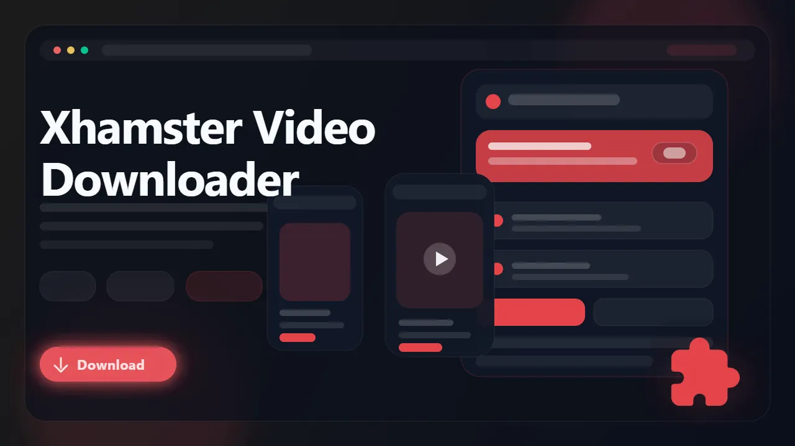

# XHamster Downloader (Browser Extension)

> Download supported XHamster videos as MP4 files directly from watch pages in your browser.

XHamster Downloader is a browser extension built for users who want a cleaner way to save supported XHamster videos for offline viewing. It detects the active media source on the page, surfaces available quality options when present, and exports the final file as MP4 without requiring manual stream extraction.

- Save supported XHamster videos from watch pages
- Detect available quality variants exposed by the player
- Export MP4 files for offline playback and archiving
- Avoid manual source digging in page scripts
- Keep the whole workflow browser-native

## Links

- :rocket: Get it here: [XHamster Downloader](https://serp.ly/xhamster-video-downloader)
- :new: Latest release: [GitHub Releases](https://github.com/serpapps/xhamster-video-downloader/releases/latest)
- :question: Help center: [SERP Help](https://help.serp.co/en/)
- :beetle: Report bugs: [GitHub Issues](https://github.com/serpapps/xhamster-video-downloader/issues)
- :bulb: Request features: [Feature Requests](https://github.com/serpapps/xhamster-video-downloader/issues)

## Preview

## Table of Contents

- [Why XHamster Downloader](#why-xhamster-downloader)
- [Features](#features)
- [How It Works](#how-it-works)
- [Step-by-Step Tutorial: How to Download Videos from XHamster](#step-by-step-tutorial-how-to-download-videos-from-xhamster)
- [Supported Formats](#supported-formats)
- [Who It's For](#who-its-for)
- [Common Use Cases](#common-use-cases)
- [Troubleshooting](#troubleshooting)
- [Trial & Access](#trial--access)
- [Installation Instructions](#installation-instructions)
- [FAQ](#faq)
- [License](#license)
- [Notes](#notes)
- [About XHamster](#about-xhamster)

## Why XHamster Downloader

XHamster video pages can expose multiple media variants and player states, which makes generic download tools noisy and unreliable. A loose scan can surface the wrong asset or fail once the page swaps between different delivery methods during playback.

XHamster Downloader is built to simplify that workflow. Start the video, let the extension detect the supported stream, choose the quality you want, and export the result as MP4 from inside the browser.

## Features

- Detects supported XHamster video sources from active watch pages
- Multi-source video detection including initials, xplayer, HTML5 video, and CDN monitoring
- Lists available quality variants when present
- In-page download button built into the video player
- Exports MP4 files for simpler offline viewing
- Right-click context menu for quick downloads
- Automatic saving into a dedicated XHAMSTER folder
- Works on all xHamster domains and regional mirrors
- Works on Chrome, Edge, Brave, Opera, Firefox, Whale, and Yandex

## How It Works

1. Install the extension from the latest release.
2. Open xHamster and visit a video page.
3. Start playback so the extension can detect the stream.
4. Open the popup or use the in-page download button.
5. Choose the quality or stream option you want.
6. Download the video as MP4.
7. Save the final file locally.

## Step-by-Step Tutorial: How to Download Videos from XHamster

1. Install XHamster Downloader from the latest GitHub release.
2. Open xHamster and sign in if the page you want requires account access.
3. Visit the video page you want to keep.
4. Let the player load fully and press play.
5. Click the in-page download button on the player, or open the extension popup.
6. Review the quality options shown by the extension.
7. Select the resolution you want if multiple options appear.
8. Start the download and wait for the MP4 export to finish.
9. Open the saved file from your Downloads folder.

## Supported Formats

- Input: supported XHamster video sources (HLS, direct MP4)
- Output: MP4

Saved files use MP4 so they are easier to replay on standard media players, move between devices, or archive locally.

## Who It's For

- XHamster viewers who want offline copies of supported videos
- Users who prefer a browser extension over manual extraction
- People archiving videos they already have access to in the browser
- Users who want a simple MP4 download workflow
- Anyone who needs downloads to work across xHamster mirror domains

## Common Use Cases

- Save an XHamster video for later viewing
- Export the best available quality as MP4
- Avoid manual source extraction from the player
- Keep offline copies for personal playback
- Download from xHamster mirror sites when the main domain is unavailable

## Troubleshooting

**The extension is not detecting the video**
Start playback first and wait for the player to initialize the active source.

**No quality selector appears**
Some pages expose only one usable stream, so only one option may be available.

**The detected source seems incomplete**
Refresh the page and retry after playback starts again.

**The download stopped partway through**
Check whether your internet connection dropped during the download.

**The page requires account or paid access**
The extension only works on media you can already open and play in your active browser session.

## Trial & Access

- Includes **3 free downloads** so you can test the workflow first
- Email sign-in uses secure one-time password verification
- No credit card required for the trial
- Unlimited downloads are available with a paid license

Start here: [https://serp.ly/xhamster-video-downloader](https://serp.ly/xhamster-video-downloader)

## Installation Instructions

1. Open the latest release page: [GitHub Releases](https://github.com/serpapps/xhamster-video-downloader/releases/latest)
2. Download the correct build for your browser.
3. Install the extension.
4. Open an XHamster watch page.
5. Use the popup to detect and download the media.

## FAQ

**Can I download XHamster videos as MP4?**
Yes. Supported downloads are exported as MP4 files.

**Do I need extra software?**
No. The workflow stays inside the browser extension.

**Where are videos saved?**
They are saved to your default Downloads location, typically inside an XHAMSTER subfolder.

**Does it work on xHamster mirror sites?**
Yes. The extension supports xhamster.com and regional mirrors including xhamster.one, xhamster.desi, xhms.pro, and others.

**What quality options are available?**
The extension detects all available qualities from the source, typically multiple resolutions from 144p to 1080p or higher.

**Will it work on every page?**
It works on supported playback flows. Detection depends on how the active page exposes the media source.

## License

This repository is distributed under the proprietary SERP Apps license in the [LICENSE](LICENSE) file. Review that file before copying, modifying, or redistributing any part of this project.

## Notes

- Only download content you own or have explicit permission to save
- An internet connection is required for downloads
- Must press play before the extension can detect the video stream
- Quality depends on the media exposed by xHamster
- xHamster has many mirror domains; try a different mirror if one is blocked

## About XHamster

XHamster is a large video platform with player-managed playback and multiple encodings on many watch pages. XHamster Downloader is built to make supported downloads easier for users who already have access to those videos in the browser.
